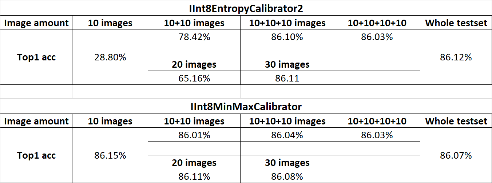
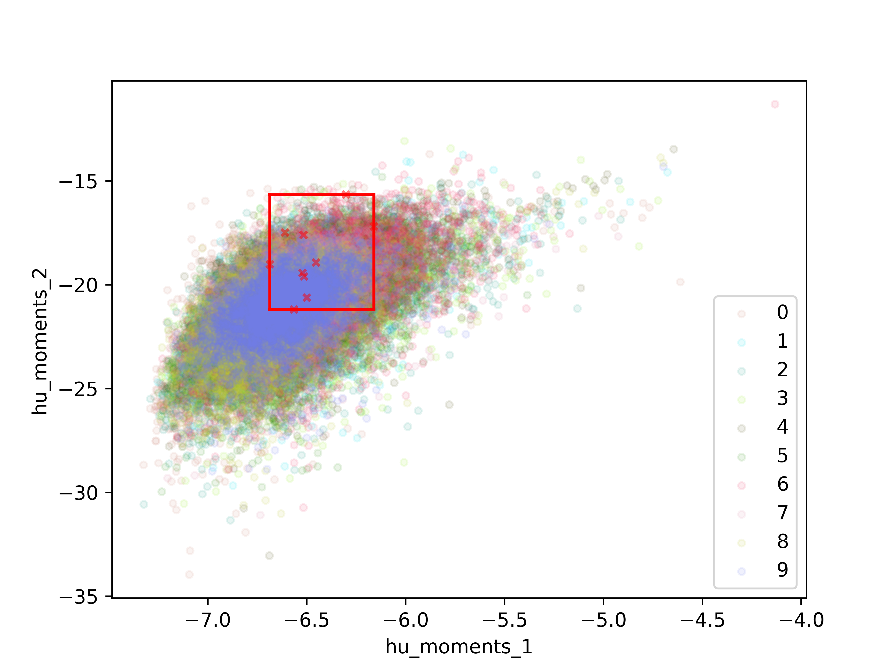
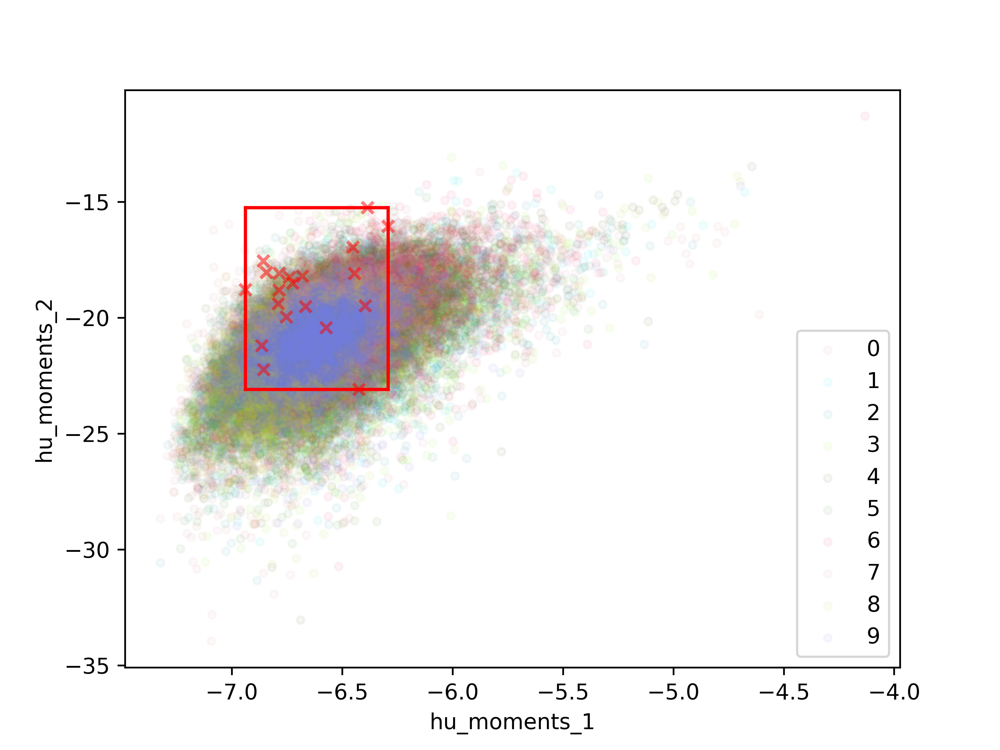
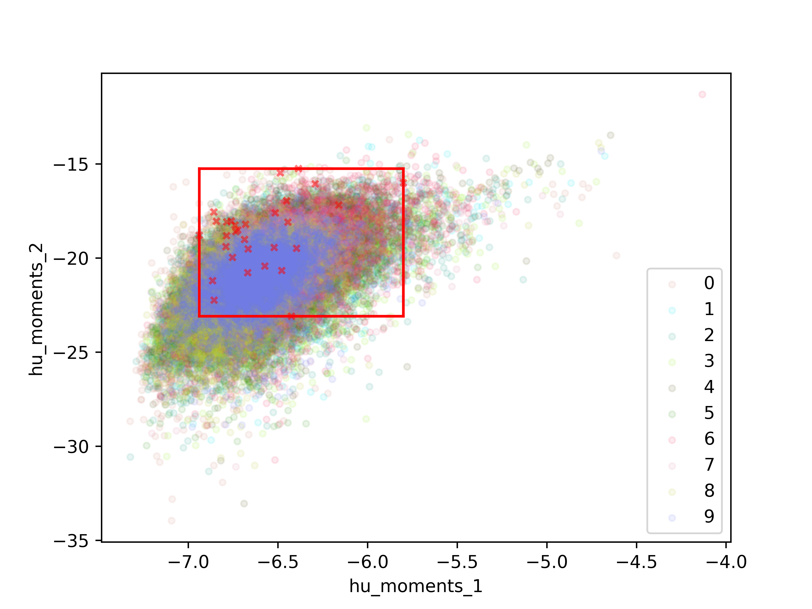
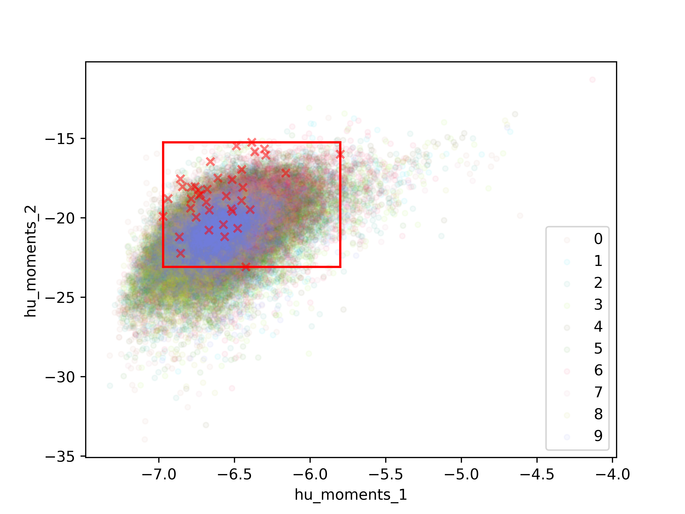

# TensorRT_quantization_demo_cifar10
This demo is to show how to build a TensorRT INT8 engine for cifar10 classification task. 
It also demonstrates that how the calibration dataset size influences the final accuracy after quantization.


The basic code is derived from one of TensorRT python samples: [int8_caffe_mnist](https://github.com/NVIDIA/TensorRT/tree/master/samples/python/int8_caffe_mnist).
To demonstrate how the calibration dataset size influences the accuracy after int8 quantization, 
the mnist dataset was changed into cifar10 dataset, and the LeNet was changed into ResNet18.
The ResNet18 onnx model comes from the repo of [pytorch-onnx-tensorrt-CIFAR10](https://github.com/shiyongming/pytorch-onnx-tensorrt-CIFAR10).


### Run it step by step
0.1 start a NGC TensorRT container: `nvcr.io/nvidia/tensorrt:21.03-py3`
0.2 `git clone https://github.com/shiyongming/TensorRT_quantization_demo_cifar10.git`
0.3 `cd TensorRT_quantization_demo_cifar10`
0.4 ```pip install -r requirements.txt``` 
1. You need to change the `ONNX_PATH` (line 136 in sample.py) into your own path where you save the `resnet18.onnx`.
2. You need to change the `cifar10_data_path` (line 137 in sample.py) into your own path where you save the cifar10 test data`test_batch`.
3. You need to change the `calib_data_path` (line 138 in sample.py) into your own path where you save data for cailbration.
4. `total_images` and `batch_size` (line 144 in sample.py) are the total images number you used for calibration and batch size for loading the calibration data. 
   They should also be changed.
    
5. If you want to use the whole test dataset to do the calibration. You can use `convert_to_images.py` to convert the cifar10 `test_batch` file into jpeg images. 
   Note that to change the path into your own path.

6. ```python sample.py```


7. Select different calibration folder in `cifar10_dataset` to see the inference caused by calibration dataset size and calibration batch size.


8. change the condition in line 64~68 of sample.py to fallback some layers into higher precision.


### Results
Before quanztization, the orignal top-1 accruacy on test_batch is 87.81%. After quantization, the top-1 accuracy is shown as below.



'10+10' images means that we add another 10 images into the existed '10' images. And '10+10+10' means we add another 10 images into the existed '10+10' images. 

'20' and '30' images means the calibration image set was selected randomly.

To evaluate the quality of calibration set. I adopt my another repo [calib-dataset-eval](https://github.com/shiyongming/calib-dataset-eval) 
to calculate and analysis the distribtion of the calibration dataset.


 <br/>
--------------- 10 calibration images ---------------------------- 20 calibration images ---------------<br/>

 <br/>
--------------- 30 calibration images ---------------------------- 40 calibration images ---------------<br/>

It can be seen that, from 10 images to 40 calibration images, the distribution covers more and more area.
As a result, the accruacy was increased. And it also can be seen that, some area still not be covered.
So, it guides us that, if we want to improve the quantization preformance, we need to add more images to cover the uncovered area.